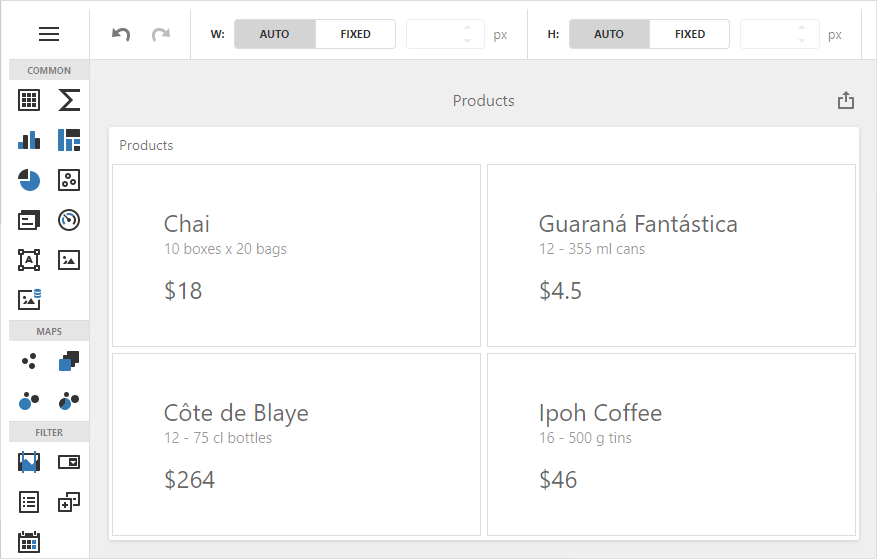

<!-- default badges list -->

[](https://supportcenter.devexpress.com/ticket/details/T828585)
[](https://docs.devexpress.com/GeneralInformation/403183)
<!-- default badges end -->

# Dashboard for Angular - Get Started

This project demonstrates how to incorporate a DevExpress Dashboard component into a client-side app built with Angular. You can use it as a template when you create a similar web application.



The example uses a modular client-server approach. The server (backend) project communicates with the client (frontend) application that includes all the necessary styles, scripts, and HTML templates. Note that the script version on the client should match the version of libraries on the server.

- The [asp-net-core-server](./asp-net-core-server) folder contains the backend project that targets .NET 6.
- The [dashboard-angular-app](./dashboard-angular-app) folder contains the client application built with Angular.

## Quick Start

Run the following command in the **asp-net-core-server** folder:

```
dotnet run
```

The server starts at `http://localhost:5000` and the client gets data from `http://localhost:5000/api/dashboard`. To debug the server, run the **asp-net-core-server** application in Visual Studio and change the client's `endpoint` property according to the listening port: `https://localhost:44308/api/dashboard`.

See the following section for information on how to install NuGet packages from the DevExpress NuGet feed: [Install DevExpress Controls Using NuGet Packages](https://docs.devexpress.com/GeneralInformation/115912/installation/install-devexpress-controls-using-nuget-packages).

> This server allows CORS requests from _all_ origins with _any_ scheme (http or https). This default configuration is insecure: websites can make cross-origin requests to the app. We recommend that you specify the client application's URL to prohibit other clients from accessing sensitive information stored on the server. More information: [Cross-Origin Resource Sharing (CORS)](https://docs.devexpress.com/Dashboard/400709).

In the **dashboard-angular-app** folder, run the following commands:

```
npm install
npm start
```

Open ```http://localhost:4200/``` in your browser to see the result.

## Files to Review

* [app.component.html](./dashboard-angular-app/src/app/app.component.html)
* [app.component.ts](dashboard-angular-app/src/app/app.component.ts)
* [Program.cs](./asp-net-core-server/Program.cs)

## Documentation

- [Create an Angular Dashboard Application](https://docs.devexpress.com/Dashboard/400322)
- [Dashboard Component for Angular](https://docs.devexpress.com/Dashboard/401976)
- [Install DevExpress Controls Using NuGet Packages](https://docs.devexpress.com/GeneralInformation/115912/installation/install-devexpress-controls-using-nuget-packages)

## Examples
- [Dashboard for Angular - Configuration](https://github.com/DevExpress-Examples/dashboard-angular-app-configuration)
- [Dashboard for React - Get Started](https://github.com/DevExpress-Examples/dashboard-react-app-get-started)
- [Dashboard for Vue - Get Started](https://github.com/DevExpress-Examples/dashboard-vue-app-get-started)
- [Dashboard for ASP.NET Core - Backend](https://github.com/DevExpress-Examples/asp-net-core-dashboard-backend)
